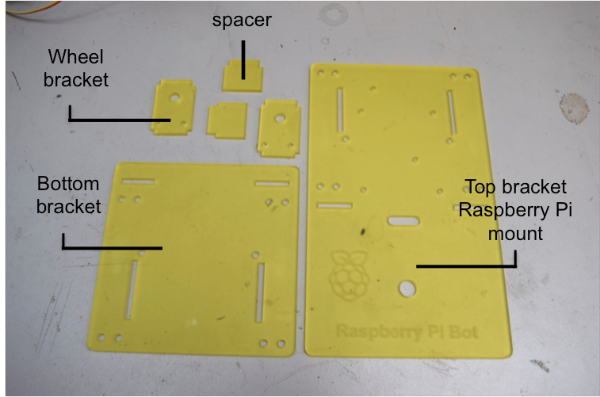
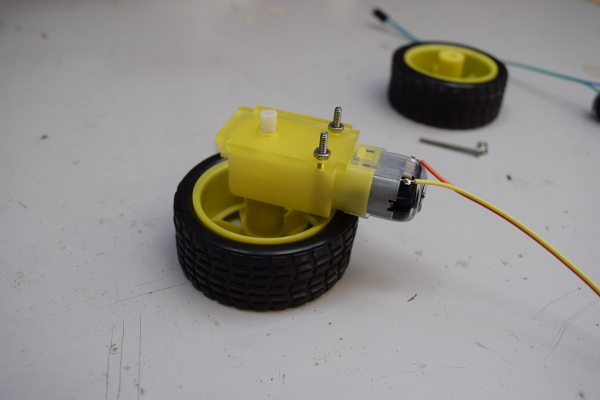

# Build your First Robot


## Step 1: Create your Robot Chassis
Any roaming robot device needs a chassis to hold the motors and wheels in place and in this case to mount your Raspberry Pi onto. If you already have a chassis then you can skip this step and go onto the next one. 

You may have access to a make space that has a laser cutter, or maybe your school has one which you can ask to adult to help you cut the chassis that we have used in this tutorial. 

- Print this file to make a paper template
- Use this file with a laser cutter

## Step 2: Build our Robot Chassis
Unless you have used our Robot chassis, build your chassis by following the manufacturers instructions and move onto Step 3.

1. Lay out all the parts of your robot chassis. 

	
	
1. Connect the wheels to their motor and gears by pushing the white rod into the centre of the wheel.
1. Take two male to female jumper wires, and cut off the female end connectors.
1. Ask an adult to strip and solder the exposed wires to the metal connectors underneath the motor, one on each side. 
1. Repeat the above steps on the second wheel and motor.

	

1. Attach the wheel brackets to the wheel motors with some M3 screws so that your wheels look like the above image.
1. Using some M2.5 screws attach your Raspberry Pi to the mount board. 
1. Sandwich the two wheels between the top bracket that your Raspberry Pi sits on, with the smaller bottom bracket. Using cable ties on each of the four corners to hold them together.


## Step 3: Connect to your Raspberry Pi

1. Connect your Raspberry Pi to a monitor, keyboard and mouse before turning it on. Log in and then load the graphical user interface by typing `startx`.
1. Open an `LXTerminal` window by double clicking the icon on the desktop.
1. Type `sudo idle3 &` to load the Python 3 programming environment. 
1. Once it has loaded open a new text editor file by clciking on **File** and **New Window**.

## Step 4: Make your robot move

Now you are setup, you can write the code to make your bot move! 

1. Begin by importing the Pibrella library by typing `import pibrella` on the first line. 
1. On the next line type `import time`, you will need this library to add pauses in the program.
1. Next type:

	```python
	pibrella.output.e.on()
    	pibrella.output.f.on()
    	time.sleep(2)
    	pibrella.output.e.off()
    	pibrella.output.f.off()
    	```
1.     
